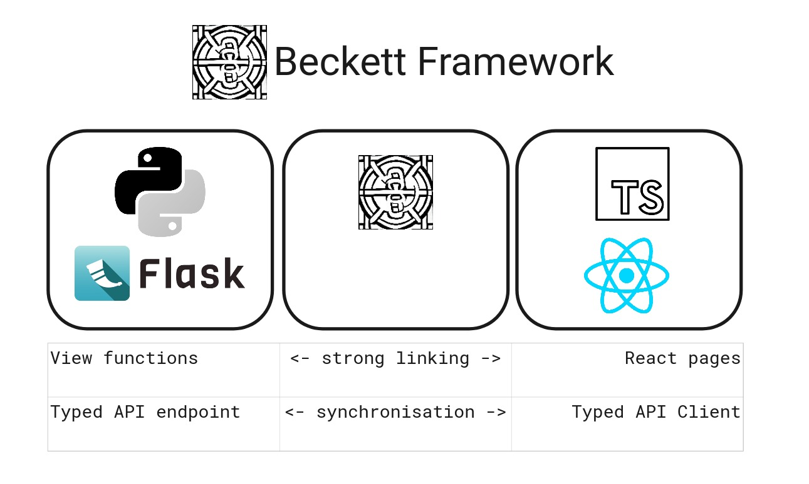

# 💫 Beckett Framework

_The Efficient Framework for Building Type-Safe Python Web Servers and React TypeScript Websites_


Welcome to Beckett, a solution for rapidly constructing type-safe Python web servers and React TypeScript websites while ensuring consistent typing interfaces across both languages.

Beckett seamlessly combines the power of [Flask](https://flask.palletsprojects.com/en/2.3.x/), a popular Python web framework, with a robust [React TypeScript](https://www.typescriptlang.org/docs/handbook/react.html) web server, providing a comprehensive full stack framework. Unlike traditional project set ups, Beckett eliminates the need for an intermediary domain language because it tightly couples the Typed API interface, resulting in a more streamlined development process.

At its core, Beckett features a sophisticated types manager that automatically synchronizes [Python Type hints](https://docs.python.org/3/library/typing.html) and [TypeScript interfaces](https://www.typescriptlang.org/docs/handbook/interfaces.html). This means that as you make changes to your code, Beckett diligently keeps the API interface definitions in both languages in perfect harmony. Gone are the worries about compatibility issues when deploying changes—the Beckett framework ensures seamless deployments.

While Beckett is strongly opinionated, favoring specific design choices, it significantly enhances productivity by providing a cohesive development experience and reducing the time spent on manual synchronization.



## Harnessing Powerful Tools: Beckett's Foundation

Beckett harnesses the power of industry-leding tools by seamlessly integratin a [Flask web server](https://flask.palletsprojects.com/en/2.3.x/) and a [React](https://react.dev/) [TypeScript](https://www.typescriptlang.org/) frontend into a unified framework.

Both TypeScript and Python hold their positions as two of the [most widely used programming languages globally](https://www.statista.com/statistics/793628/worldwide-developer-survey-most-used-languages/). As a result, they are frequently combined in various projects.
However, setting up a smooth and efficient development environment that harmoniously integrates these languages can be a cumbersome and time-consuming process, often leading to a subpar developer experience.

Thankfully, Beckett steps in to solve this challenge by tightly coupling TypeScript and Python, uniting them as a cohesive framework.

## Unleasing Their Individual Potential

Beckett recognizes that each language excels in different domains and allows you to leverage their strengths as needed. You can continue to write Flask views just as you would in a typical Flask application, benefiting from the extensive ecosystem of Python libraries that seamlessly integrate with Flask.

Simultaneously, you can harness the power of React TypeScript for your frontend development, providing an optimal solution. Write your React components and TypeScript code as you would in any other React application, and effortlessly incorporate any JavaScript library you desire by using `yarn add` to meet the specific requirements of your project.

Beckett empowers you to continue utilizing these languages individually, allowing you to take advantage of their distinctive capabilities while enjoying the enhanced development experience offered by the unified framework.

## Set up

Fork the code, then run the build and dev command to get started:

```bash
git clone git@github.com:beckett-software/beckett-framework.git
cd beckett-framework
make build
make dev
```
